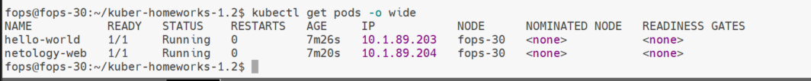
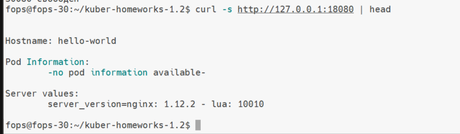
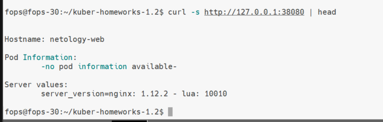
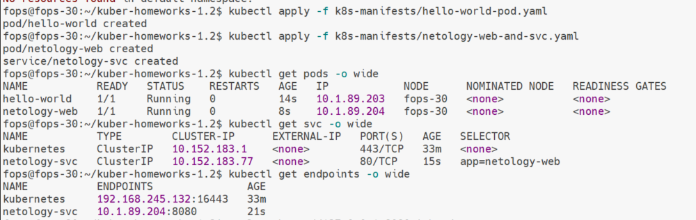

# Домашнее задание к занятию «Базовые объекты K8S»

---

## Задание 1. Pod `hello-world`

### Манифест Pod
Файл с манифестом Pod:
- [k8s-manifests/hello-world-pod.yaml](k8s-manifests/hello-world-pod.yaml)


### Проверка состояния Pod
Команда:
```bash
kubectl get pods -o wide
```

Скриншот вывода команды:



### Подключение к Pod через port-forward
Для подключения к Pod использовался проброс портов:
```bash
kubectl port-forward pod/hello-world 18080:8080
curl http://127.0.0.1:18080
```

Скриншот результата подключения:



---

## Задание 2. Pod `netology-web` и Service `netology-svc`

### Манифест Pod и Service
Файл с манифестами Pod и Service:
- [k8s-manifests/netology-web-and-svc.yaml](k8s-manifests/netology-web-and-svc.yaml)

Service настроен со следующими параметрами:
- Type: ClusterIP
- Selector: `app=netology-web`

### Подключение к Service через port-forward
Для подключения к Service выполнен проброс портов:
```bash
kubectl port-forward svc/netology-svc 38080:80
curl http://127.0.0.1:38080
```

Скриншот результата подключения:



### Общий скриншот
